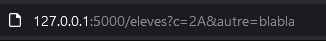
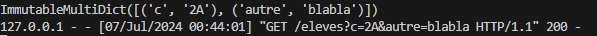
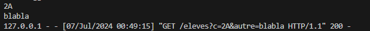

TUTORIEL FLASK #2 : Tranmsettre des parametres dans l'URL
=========================================================

[source du tuto](https://www.youtube.com/watch?v=lvxqvNXniVc&list=PLV1TsfPiCx8PXHsHeJKvSSC8zfi4Kvcfs&index=2)

- le point d'intergation _?_ apres l'adresse du serveur dans l'url indidique que des parametres seront passes au serveur dans la requete GET
- les parametres sont de la forme _nom=valeur_
- separes par le caractere _&_

Comment le serveur Flask construit une page a partir des parametres passes dans l'URL et la renvoie au navigateur
-----------------------------------------------------------------------------------------------------------------

- soit une liste d'eleves
- chaque eleve est represente par un dicionnaire ayant 3 cles, nom, prenom et classe

1. l'ojectif est de creer une route dans laquelle on va passer un parametre, la classe
2. le serveur va recuperer cette information
3. et va construire la page web avec la liste des eleves dans cette classe

ex: ```http://127.0.0.1:500/eleves?c=2A```


soit la **fonction** _eleves()_ associe a la **route** _"/eleves"_ qui renvoit un **template** _"eleves.html"_


l'objet **request** contient toutes les informations de la requete, et donc si il y a des parametres dans la requete on pourra les recuperer

- la saisie de l'URL 

- affichera via  ```print(request.args)``` 




c'est un dictionnaire donc 
```python
print(request.args['c'])
print(request.args['autre'])
```
affiche
