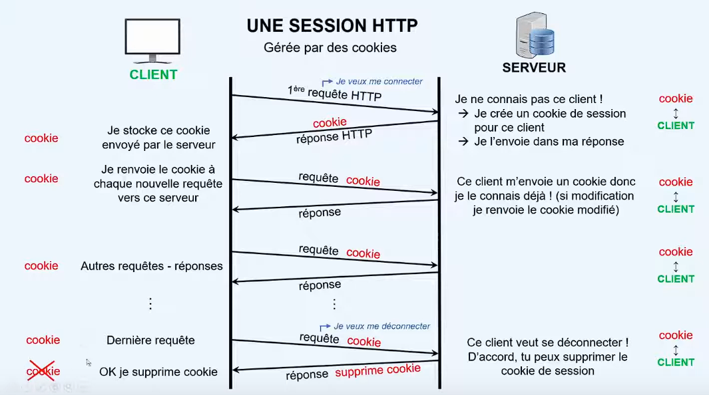

TUTORIEL FLASK #5 : Les sessions HTTP pour memoriser des informations d'une requete HTTP a une autre
====================================================================================================

[source du tuto](https://www.youtube.com/watch?v=FdA1P7dY_18&list=PLV1TsfPiCx8PXHsHeJKvSSC8zfi4Kvcfs&index=5)

*exemple* 
- un utilisateur entre son login / password et il reste connecte pour voir d'autres pages du site sans avoir a se re-authentifier

Session HTTP : Definition
-------------------------

- ensemble d'echanges entre le client et le serveur
- etablissement d'une connexion
  - 1ere requete HTTP
  - la reponse HTTP
- les echanges requetes/reponses
- deconnexion
- une session permet de suivre un utilisateur de page en page
- le serveur va donc se souvenir des differentes requetes effectuees par un client
- les sessions HTTP sont geres par des *cookies*
- les cookies sont des fichiers textes echanges entre le client et le serveur
- les cookies stockent les informations des clients qui se connecte au serveur
  
les cookies HTTP
----------------

- les sessions HTTP sont geres par les cookies
- a la 1ere connexion du client au serveur, celui ci ne le connait pas
- le serveur cree un cookie de session associe a ce client et l'envoi dans sa reponse au client
- donc la reponse HTTP de la 1ere reponse contient le cookie

- lorsque le client recupere la reponse, il socke le cookie en memoire
- puis lors des prochaine requete du client au serveur, le client verifie si il ne possede pas un cookie correspondant a ce serveur
- si c'est le cas il envoie le cookie dans chacune de ses nouvelles requetes

- le serveur lorsqu'il recoit la requete voit qu'elle est accompagne d'un cookie et peut donc reconnaitre le client
- ainsi le serveur identifie le client qui lui envoi la requete

- lorsque le client se deconnecte du serveur
- le serveur demande au client de supprimer le cookie
- en general via une date d'expiration depassee

Exemple d'un compteur de visite pour illustrer le concept
---------------------------------------------------------

- soit une page web qui indique le nombre de fois que cette page a ete visite

- l'objet session memorise des informations grace a la creation d'un cookie
- ces informations sont chiffres grace a une cle secrete

[generer une cle secrete](https://flask.palletsprojects.com/en/3.0.x/quickstart/#sessions)

si 1ere visite alors initialisation du compteur a 1
sinon incrementation du compteur

lorsque l on ferme le navigateur le cookie de session est supprime, pas lorsque l'on ferme un onglet
- il faut configurer firefox pour qu'il supprime les cookies a la fermeture
- 

